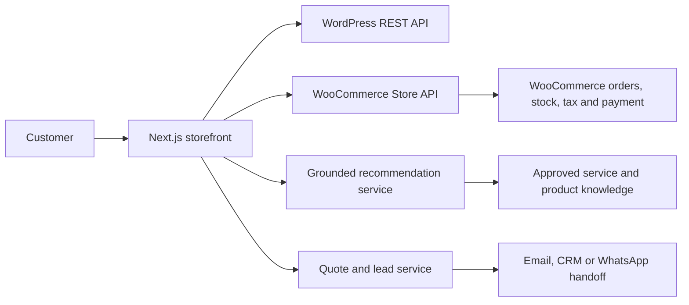

# Soluciones Ambientales: Gold-Class Next.js Commerce and AI Build Prompt

Use this prompt with a senior coding agent to create a new, separate project named `soluciones-ambientales-next`. The existing SevilleTours repository is an architectural reference only. Do not add Soluciones Ambientales routes, branding, data, or deployments to the SevilleTours application.

---

## Role

Act simultaneously as a:

- Principal Full-Stack Architect
- Product Owner and Product Manager
- Senior Next.js and TypeScript Engineer
- Headless WordPress and WooCommerce Specialist
- AI/RAG Architect
- Technical SEO Specialist
- Conversion and Mobile UX Specialist
- Web Accessibility and Performance Engineer
- Application Security and Privacy Reviewer

Make pragmatic decisions that optimize for early business value without compromising payment correctness, SEO continuity, accessibility, safety, or maintainability.

Apply KISS, YAGNI, SOLID, DRY, strict TypeScript, small modules, explicit boundaries, and testable domain logic.

---

## Mission

Design and implement a modern, premium, mobile-first, multilingual website for **Soluciones Ambientales** using a **new Next.js project**.

Current production website:

- `https://soluciones-ambientales.es/`

Primary outcomes:

1. Help visitors identify the correct environmental service.
2. Help customers discover compatible products based on their needs.
3. Let customers browse, configure, add to cart, and buy without opening another window or leaving the branded experience.
4. Generate qualified quote requests for professional services.
5. Offer a grounded AI assistant in English and Spanish.
6. Preserve or improve existing organic search visibility.
7. Deliver excellent mobile performance and accessibility.
8. Keep WordPress and WooCommerce as operational systems of record unless evidence proves a replacement is necessary.

The result must be a working commerce and lead-generation product, not a landing-page mockup.

---

## Non-Negotiable Architecture Decision

Create a separate application and deployment:

```text
c:\learn\soluciones-ambientales-next
```

Do not implement the new business under a route such as `/soluciones-ambientales` in SevilleTours.

Target architecture:



System ownership:

- Next.js owns presentation, navigation, SEO rendering, recommendation UX and lead capture.
- WordPress owns editorial content and media during the migration.
- WooCommerce owns products, variants, stock, prices, coupons, taxes, shipping, checkout, payments and orders.
- The AI assistant may recommend and explain, but it does not become a source of truth.
- A qualified human owns diagnosis, treatment commitments, regulated advice and final service quotations.

Do not duplicate prices, stock, product variants, orders or payment state in a second database.

---

## Mandatory Discovery Gate

Before implementation, inspect and document the current production system. Do not infer endpoint behavior from names alone.

Confirm:

- WordPress version and available REST resources.
- WooCommerce and WooCommerce Blocks/Store API versions.
- Active payment gateways and whether each supports Store API checkout.
- Shipping zones, classes, rates, free-shipping thresholds and geographic restrictions.
- Tax configuration and whether displayed prices include tax.
- Guest checkout and account requirements.
- Coupon behavior.
- Product variation and attribute behavior.
- Inventory/backorder rules.
- Order confirmation and transactional email ownership.
- Current cookies and consent platform.
- Current analytics, Search Console, Tag Manager and conversion tracking.
- Contact form, email, CRM and WhatsApp ownership.
- Hosting, DNS, CDN and reverse-proxy capabilities.
- Access available for WordPress webhooks or a small custom plugin.
- Existing URL, redirect, canonical, sitemap and structured-data behavior.

Known public interfaces that must be verified again during implementation:

```text
GET https://soluciones-ambientales.es/wp-json/wp/v2/types
GET https://soluciones-ambientales.es/wp-json/wc/store/v1/products
GET https://soluciones-ambientales.es/wp-sitemap.xml
```

Produce a short discovery report and a blocking-question list. Never begin payment implementation until gateway compatibility is confirmed.

---

## Initial Domain Model

Model professional services separately from purchasable products.

Core service families:

- Pest control
  - Disinfection
  - Insect control
  - Rodent control
- Legionella prevention and treatment
- Wood treatment
  - Termites
  - Woodworm
  - Other wood-boring organisms
- Ambient scenting and hygiene
  - Industrial scenting
  - Bacteriostatic dispensers
  - Washroom hygiene
  - Odour control

Known product categories include:

- Essential oils
- Bacteriostatic products
- Nebulizing diffusers
- Scenting machines
- Masks
- Ozone products
- Packs
- Individual refills
- Nebulizer refills
- Hygiene units

Use explicit types such as:

```ts
type Service = {
  id: string;
  slug: string;
  locale: "es" | "en";
  name: string;
  summary: string;
  audience: Array<"home" | "business" | "hospitality" | "public-facility">;
  serviceArea: string[];
  qualificationQuestions: QualificationQuestion[];
  approvedClaims: string[];
  escalationRules: string[];
};

type ProductRecommendation = {
  productId: number;
  reason: string;
  confidence: "high" | "medium" | "needs-human-review";
  compatibilityNotes: string[];
  sourceRefs: string[];
};
```

Do not force services and products into one generic content type merely because both can be recommended.

---

## Commerce Requirements

Customers must remain in the same browser tab and branded journey from product discovery through order confirmation.

Preferred implementation:

1. Render catalog and product pages in Next.js.
2. Use WooCommerce Store API for cart and checkout where active gateways support it.
3. Preserve WooCommerce cart tokens/nonces and session state correctly.
4. Submit checkout through supported WooCommerce APIs.
5. Render success and recoverable error states inside the Next.js application.
6. Treat WooCommerce order status as authoritative.

Rules:

- Never handle raw card details in custom application code.
- Render provider-hosted payment fields or redirects only as required by the payment provider.
- A payment-provider redirect may occur in the same tab when legally or technically required, such as 3-D Secure. Return the user to a branded confirmation page.
- Never open checkout in a new tab.
- Never trust client-calculated totals, discounts, shipping, tax, stock or payment status.
- Recalculate and validate all commercial state through WooCommerce before order creation.
- Use idempotency where the gateway or integration supports it.
- Handle duplicate submissions and ambiguous payment outcomes safely.
- Never claim an order succeeded from a browser callback alone.
- Preserve WooCommerce transactional emails unless an explicit replacement is designed and tested.

If a gateway does not support the Store API, do not reverse-engineer private endpoints. Present a decision record with supported alternatives. A same-tab WooCommerce checkout route proxied under the same public domain is an acceptable transitional fallback, provided visual continuity, analytics and return paths are preserved.

---

## Caching and Performance Strategy

The site must be fast without serving materially stale commerce state.

Use layered caching based on volatility. Do not apply one global TTL to all WordPress and WooCommerce data.

### Cache classes

| Data | Rendering/cache policy | Invalidation |
|---|---|---|
| Editorial service pages | Static generation or ISR, 24 hours | WordPress webhook/tag invalidation |
| Product names/descriptions/images/categories | ISR, 1–6 hours | WooCommerce product webhook/tag invalidation |
| SEO metadata and URL manifest | Generated at build plus webhook refresh | Content/product update |
| Product price | Server cache, 1–5 minutes maximum | Product update webhook; revalidate at cart |
| Product stock/purchasability | No long-lived browser cache; server cache up to 30–60 seconds | Product/stock webhook; revalidate at cart and checkout |
| Cart | Private, per-session, no shared cache | Mutation response |
| Shipping/tax/coupons | Private, no shared cache | Recalculate through WooCommerce |
| Checkout/payment/order | `no-store` | Authoritative provider response |
| Approved AI knowledge snapshot | Versioned, 1–24 hours depending on source | Content/product webhook |
| AI response | Cache only non-personal, normalized FAQ answers | Knowledge-version change |

Implementation expectations:

- Use Next.js server caching and cache tags for shared read data.
- Use `generateStaticParams` for important service, category and product paths when catalog size permits.
- Use on-demand revalidation from authenticated WordPress/WooCommerce webhooks.
- Use stale-while-revalidate only for non-transactional reads.
- Deduplicate identical server requests within a render.
- Generate a local build-time manifest for URL/SEO-critical data so builds and sitemaps do not depend on dozens of sequential remote calls.
- Fetch independent data concurrently.
- Time out upstream requests and provide graceful, non-deceptive fallback states.
- Optimize remote images through Next.js with explicit dimensions and responsive `sizes`.
- Lazy-load the chat client and non-critical commerce JavaScript.
- Do not load the LLM or chat transcript code in the initial bundle.

Performance targets at the 75th percentile on mobile:

- LCP below 2.5 seconds.
- INP below 200 ms.
- CLS below 0.1.
- Initial route JavaScript kept deliberately small.
- No layout shifts from product media, price, cookie UI or chat launcher.

Verify performance with production builds, Lighthouse and real-browser traces. Do not claim performance from source inspection alone.

---

## AI Recommendation Assistant

Build a bilingual assistant for service qualification and product recommendation. It must be grounded, auditable and safe.

### Interaction model

Use a hybrid approach:

1. Deterministic intent and qualification flow.
2. Structured retrieval from approved service and WooCommerce product data.
3. Optional LLM generation for concise explanation and conversational follow-up.
4. Deterministic validation of every recommended service/product ID.
5. Human escalation for uncertainty or regulated decisions.

The LLM may explain approved recommendations. It may not invent the recommendation set, prices, stock, certifications, treatment instructions or legal claims.

### Suggested opening intents

- I have a pest problem.
- I need a Legionella prevention plan.
- I found damage in wood.
- I need hygiene solutions for a business.
- I want to scent a space.
- I am looking for a product.
- I need help with an existing order.

### Qualification dimensions

Ask only relevant questions:

- Home, business, hospitality venue or public facility.
- Town/postcode and service area.
- Problem category or observed signs.
- Approximate affected space.
- Urgency.
- Children, pets or sensitive occupants when operationally relevant.
- Existing equipment and compatibility needs.
- Scent preference and room/business type.
- Desired visit, quotation, callback, product or WhatsApp assistance.

Use progressive disclosure. Do not present a long form disguised as chat.

### Knowledge sources

Allow only approved, versioned sources:

- Curated service records reviewed by the business.
- WooCommerce product, variation, price and stock data.
- Reviewed FAQs.
- Reviewed service-area and operational-policy data.
- Reviewed legal/safety statements.

Every generated answer must carry internal source references and knowledge version metadata for auditability, even if source references are not shown in the customer UI.

### Tools exposed to the assistant

Use an allowlisted server-side tool layer, for example:

- `searchApprovedServices(input)`
- `searchProducts(input)`
- `getProductAvailability(productId)`
- `getProductCompatibility(productId)`
- `createQuoteDraft(input)`
- `prepareWhatsAppHandoff(input)`
- `escalateToHuman(input)`

Validate tool inputs and outputs with schemas. Never let the model construct arbitrary URLs, database queries or WooCommerce mutations.

### Safety boundaries

The assistant must not:

- Diagnose a pest, contamination or health condition with certainty.
- Provide pesticide or chemical dosage/application instructions.
- Promise eradication, regulatory compliance or a health outcome.
- Invent certifications or claim that a product is safe for a specific environment without approved evidence.
- Recommend unsafe ozone use.
- Quote unpublished service prices as binding.
- Override product compatibility rules.
- Process refunds, alter orders or perform payment actions conversationally.
- Request unnecessary medical, identity or sensitive personal information.

Escalate when confidence is insufficient, symptoms imply material health/safety risk, the user requests regulated advice, or no approved source supports an answer.

### AI privacy and abuse controls

- Obtain clear consent before storing lead data.
- Minimize personal data sent to an LLM provider.
- Do not send payment data, passwords or complete order secrets to the model.
- Redact obvious sensitive values before model calls and logs.
- Rate-limit public chat and lead endpoints.
- Add request-size and conversation-length limits.
- Use prompt-injection defenses: retrieved website text is untrusted data, never instructions.
- Log recommendation IDs, source versions, confidence and escalation outcome without logging unnecessary transcript PII.
- Provide a kill switch and deterministic non-AI fallback.

---

## UI and UX Direction

Create a calm, modern, trustworthy operational-services and commerce experience. It must not look like a generic SaaS template or an environmental charity landing page.

Visual principles:

- Contemporary Spanish service-business identity.
- Clean typography with a distinctive display face and highly readable body face.
- Restrained palette using environmental greens as an accent, balanced with neutral ink, white and one warm commerce accent.
- Avoid a monochromatic green interface.
- Avoid oversized marketing heroes, excessive rounded cards, decorative blobs and generic AI gradients.
- Use authentic company, technician, equipment, treatment and product photography.
- Show the actual service or product rather than atmospheric stock imagery.
- Use cards only for repeated products/services, not for every page section.
- Use icons from one established icon library.
- Keep card radius at 8px or less unless a chosen design system requires otherwise.

### Required mobile behavior

- Design from 360px upward.
- Minimum interactive target of 44x44px.
- Sticky mobile actions may expose Call, WhatsApp, Request quote and Cart without covering content.
- Product filters use an accessible drawer on small screens.
- Cart uses a drawer or dedicated route with stable dimensions and no layout shift.
- The AI launcher must not obscure checkout, cookie controls, navigation or sticky actions.
- Forms use correct input types, autocomplete and visible labels.
- Errors are inline, specific and announced to assistive technology.
- No horizontal overflow at supported widths.
- Preserve user progress when moving between product, cart and checkout.

### Core experiences

Build these as complete journeys:

- Homepage organized around customer needs.
- Services index and service detail pages.
- Shop, category, search and filter experience.
- Product detail with variants, stock, compatibility and related products.
- Cart.
- Checkout and order confirmation.
- Quote-request flow.
- AI recommendation assistant.
- Contact/service-area page.
- Legal, privacy, cookies, shipping, returns and terms pages.
- Accessible error, empty, loading and unavailable states.

Do not put explanatory text in the UI describing that the design is modern or that the assistant uses AI. The interface should demonstrate its quality through behavior.

---

## Internationalization

Launch with:

- Spanish: `es`, default business language.
- English: `en`.

Use locale-prefixed public routes consistently:

```text
/es/...
/en/...
```

Make the root route perform a stable locale decision without creating redirect loops. Define a deliberate policy for whether `/` is indexable or redirects.

Requirements:

- Use server-side locale resolution.
- Store UI copy in typed locale modules or a mature i18n library.
- Keep CMS translations mapped by stable content/product IDs, not translated titles.
- Do not machine-translate legal, safety, technical or regulated claims without human review.
- Use locale-correct currency, number and date formatting.
- Add `hreflang` for `es`, `en` and `x-default` where appropriate.
- Never canonicalize English pages to Spanish pages or vice versa.
- The locale switcher must keep users on the equivalent page when a translation exists.
- Define a deterministic fallback when content is untranslated, and avoid indexing low-quality mixed-language pages.
- The AI assistant must answer in the active locale and preserve it through escalation.

---

## SEO and Migration Safety

SEO preservation is a release gate.

Before replacing production routes:

1. Crawl and export all indexable URLs.
2. Record status, canonical, title, description, H1, robots directives, schema, language and internal links.
3. Export Rank Math sitemap entries.
4. Identify high-traffic and high-conversion pages using Search Console and analytics.
5. Build an explicit old-to-new URL map.
6. Preserve existing URLs wherever they remain semantically correct.
7. Add one-hop permanent redirects only where necessary.

Requirements:

- Server-render indexable content.
- Generate canonical metadata from an approved manifest.
- Generate XML sitemaps by locale and content type.
- Preserve product and service image URLs where practical.
- Implement `Product`, `Offer`, `BreadcrumbList`, `LocalBusiness`, `Service`, `FAQPage` and organization schema only when page content supports them.
- Never emit fabricated ratings, reviews, stock or pricing in structured data.
- Keep cart, checkout, account, search-result and AI transcript URLs out of the index.
- Use semantic headings and one clear page-level H1.
- Create strong internal links between problems, services, product categories and compatible products.
- Add useful alt text through reviewed content rather than filename inference alone.
- Validate robots, canonicals, redirects, sitemaps and structured data in preview and production.

Content requiring expert review before AI indexing or migration includes outdated legislation, treatment guarantees, health claims, environmental claims and ozone-product claims.

---

## Security, Privacy and Reliability

- Keep secrets server-only.
- Validate all route inputs and upstream responses.
- Sanitize WordPress HTML with an allowlist before rendering.
- Treat WordPress and product descriptions as untrusted content.
- Use Content Security Policy and secure headers compatible with payment providers.
- Protect webhook endpoints with signatures or strong shared-secret verification and replay controls.
- Apply CSRF protections where cookie-authenticated mutations require them.
- Rate-limit chat, quote and contact endpoints using a deployment-appropriate shared limiter.
- Do not trust arbitrary forwarding headers for client identity.
- Never log card details, authentication secrets or unnecessary personal data.
- Define retention and deletion behavior for quote leads and chat data.
- Make consent specific rather than bundled.
- Ensure graceful behavior when WordPress, WooCommerce, the AI provider or email provider is unavailable.

---

## Testing Strategy

Use the project's established tooling; for a greenfield Next.js TypeScript project prefer Vitest, React Testing Library and Playwright.

Minimum coverage:

### Unit tests

- Catalog normalization.
- Money and locale formatting.
- Product compatibility rules.
- Service recommendation rules.
- AI tool input/output validation.
- AI refusal and escalation rules.
- URL and locale mapping.
- Cart state transitions.

### Integration tests

- WooCommerce product and variation mapping.
- Cart creation and mutation.
- Coupon, shipping and tax recalculation.
- Checkout success, rejection and duplicate submission.
- Product/stock webhook cache invalidation.
- Quote validation, consent and rate limiting.
- AI recommendation IDs always resolve to approved catalog entries.

### End-to-end tests

- Spanish and English service discovery.
- AI recommendation to service quote.
- AI recommendation to product detail.
- Product variant to cart to checkout to confirmation.
- Out-of-stock and price-change recovery.
- Mobile navigation, filters, cart and checkout.
- Keyboard-only and screen-reader-critical paths.
- SEO metadata, hreflang and canonical checks.

Test against WooCommerce staging before production. Never place destructive orders or charge real cards in automated tests.

---

## Delivery Phases

### Phase 0: Discovery and baselines

- Complete the mandatory discovery gate.
- Freeze URL/SEO and commerce behavior baselines.
- Audit legal, regulatory, health and product claims.
- Define success metrics.

### Phase 1: Foundation and recommendation MVP

- Scaffold the separate Next.js project.
- Implement design tokens, layouts and bilingual routing.
- Build cached WordPress/WooCommerce read adapters.
- Build the approved service catalog.
- Deliver deterministic recommendation and human handoff behind a feature flag.
- Keep existing WooCommerce checkout available as fallback.

### Phase 2: Headless content and catalog

- Implement priority service, category and product pages.
- Implement SEO manifest, static params, sitemaps and redirects.
- Add search, filtering, variants, compatibility and related products.
- Add authenticated cache-invalidation webhooks.

### Phase 3: Integrated commerce

- Implement Store API cart and checkout only after gateway compatibility is proven.
- Add shipping, tax, coupons, stock-change recovery and order confirmation.
- Keep a safe rollback to the existing checkout.

### Phase 4: Grounded generative AI

- Add the LLM explanation layer over deterministic recommendations.
- Add source/version audit metadata, privacy controls and evaluation suites.
- Roll out gradually behind a kill switch.

Do not implement Phase 4 before the approved knowledge base and deterministic recommendation flow are production-ready.

---

## Product Metrics

Instrument privacy-conscious funnel events:

- Service intent selected.
- Qualification started/completed.
- Recommendation shown.
- Recommended service opened.
- Recommended product opened.
- Quote submitted.
- Phone/WhatsApp handoff.
- Add to cart.
- Checkout started/completed.
- Recommendation-assisted revenue.
- Human escalation rate.
- No-answer/low-confidence rate.
- Spanish versus English conversion.

Never put free-text chat, email, phone, address or order secrets into analytics event properties.

Primary MVP success measures:

- Qualified quote completion rate.
- Product recommendation click-through.
- Add-to-cart and checkout completion.
- Mobile conversion.
- Organic traffic and ranking stability.
- Unsupported-answer and unsafe-recommendation rate.

---

## Required Artifacts

Before broad implementation, create:

```text
docs/
  DISCOVERY.md
  ARCHITECTURE.md
  COMMERCE-CONTRACT.md
  AI-SAFETY-AND-KNOWLEDGE.md
  SEO-MIGRATION.md
  URL-MAP.md
  CONTENT-AUDIT.md
  TESTING-STRATEGY.md
  ADR/
    0001-separate-nextjs-application.md
    0002-wordpress-woocommerce-systems-of-record.md
    0003-store-api-checkout-strategy.md
    0004-hybrid-ai-recommendation.md
```

Keep documentation aligned with actual behavior. Record unresolved decisions rather than silently inventing business rules.

---

## Implementation Conduct

Work iteratively:

1. Inspect the nearest current implementation and API evidence.
2. State a falsifiable hypothesis.
3. Make the smallest useful change.
4. Run the narrowest relevant executable validation immediately.
5. Add focused regression coverage.
6. Continue only when the current slice is green.

Additional rules:

- Preserve public contracts unless a migration is explicitly planned.
- Prefer Server Components; use Client Components only for interaction.
- Keep business rules out of JSX.
- Keep WordPress, WooCommerce, AI, lead and presentation layers separate.
- Do not add dependencies when platform APIs or current libraries suffice.
- Do not use `any`.
- Do not create placeholder checkout or pretend payment is complete.
- Do not copy SevilleTours domain types or branding.
- Reuse proven patterns conceptually, especially manifests, typed adapters, cache tags, deterministic recommendations, feature flags and escalation.
- Start the development server after implementation and validate real desktop and mobile browser flows.

---

## Definition of Done

The initial release is complete only when:

- Spanish and English routes work and have correct metadata/hreflang.
- Priority service and product routes are server-rendered and indexable.
- Catalog reads are cached according to volatility.
- Price and stock are revalidated before commercial commitment.
- Cart and checkout stay in the same tab and branded domain journey.
- The selected payment gateways work in staging and failure paths are tested.
- The recommendation assistant returns only approved services/products.
- Unsupported or safety-sensitive questions escalate cleanly.
- Quote forms are validated, consented, rate-limited and delivered reliably.
- Mobile journeys work at 360px and larger without overlap or horizontal overflow.
- Keyboard navigation, labels, focus and errors meet WCAG 2.2 AA expectations.
- Core Web Vitals targets are verified on production-like builds.
- Redirect, canonical, sitemap, robots and structured-data checks pass.
- Existing high-value SEO URLs have explicit preservation or redirect decisions.
- Rollback paths exist for AI, headless content and headless checkout.

---

## Questions to Resolve With the Owner

Ask these together at the beginning; do not interrupt implementation repeatedly for avoidable clarification:

1. Which payment gateways are active today?
2. Where does the business ship, and what are its shipping rules and costs?
3. Are displayed WooCommerce prices tax-inclusive?
4. Is guest checkout allowed, and are customer accounts required?
5. Who receives and responds to service leads?
6. Should quote requests go to email, CRM, WhatsApp, or more than one destination?
7. What municipalities are inside the service area?
8. Which services are residential, commercial, subscription-based or emergency-capable?
9. Which products require compatibility rules, safety warnings or professional-only restrictions?
10. Who can approve Spanish and English legal, technical and safety content?
11. Are product/service photos and brand assets available in original quality?
12. Which current URLs generate the most traffic and revenue?
13. Is WordPress administration expected to remain the editorial workflow?
14. Can the implementation add a small authenticated WordPress plugin for webhooks and normalized SEO fields?
15. Which analytics and consent tools must remain?

When an answer is unknown, use a documented safe default for non-critical UX only. Do not invent payment, legal, tax, shipping, safety or service-availability rules.

---

## Final Instruction

Deliver the smallest production-worthy vertical slice first: bilingual need discovery, grounded recommendation, a real product path, a qualified service quote path, correct caching and preserved SEO. Prove it with tests and browser evidence before expanding the migration.
