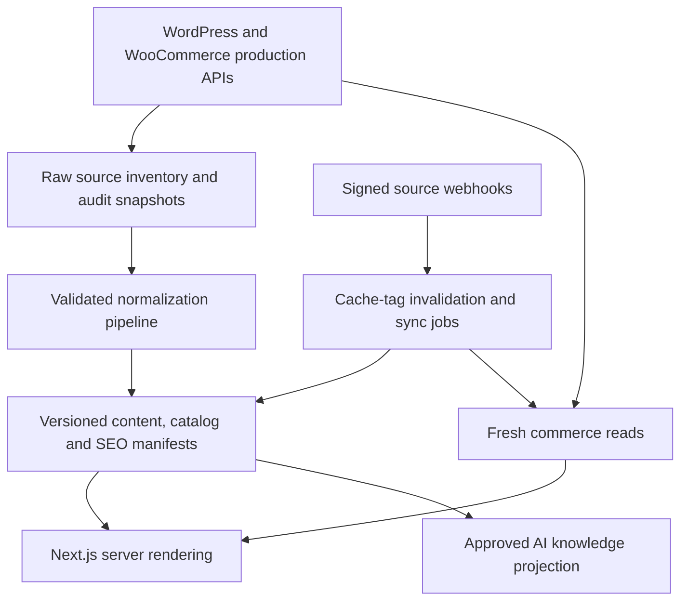
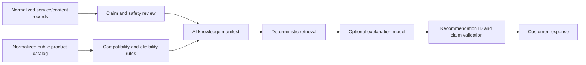

# Soluciones Ambientales: Real WordPress and WooCommerce Data Wiring Prompt

Use this prompt after the master build prompt in [soluciones-ambientales-next-master-build-prompt.md](soluciones-ambientales-next-master-build-prompt.md). It is specifically for discovering, importing, validating, caching, rendering, translating, and continuously synchronizing the real production data from:

```text
https://soluciones-ambientales.es/
```

The goal is not merely to display a few products. The goal is to establish a complete, auditable content and commerce integration in which no page, product, variation, taxonomy, image, SEO field, URL, or transactional rule can disappear silently.

---

## Role

Act as a Principal Integration Architect, Senior Next.js Engineer, WordPress REST Engineer, WooCommerce Store API Engineer, Data Migration Lead, Technical SEO Lead, AI Knowledge Engineer, QA Lead, and Product Owner.

You are working on a new separate project:

```text
c:\learn\soluciones-ambientales-next
```

The SevilleTours repository at `c:\learn\seville-tours` is a reference for useful patterns, not a domain model to copy.

Apply:

- Strict TypeScript.
- Runtime schema validation at every external boundary.
- Server-only source adapters.
- Deterministic manifests for build-time rendering.
- Cache policies based on data volatility.
- Explicit completeness reconciliation.
- Incremental, testable implementation.
- No silent data loss.
- No fabricated business rules.

---

## Mission

Wire the real WordPress and WooCommerce production data into the new Next.js application so that:

1. Every relevant existing public URL is inventoried.
2. Every published WordPress page and post is accounted for.
3. Every published WooCommerce product and variation is accounted for.
4. Product categories, tags, brands and attributes are preserved.
5. Product prices, stock, purchasability, limits and variation rules remain authoritative in WooCommerce.
6. Images, alternative text and media dimensions are retained where available.
7. Existing SEO metadata, canonicals, redirects, schema and sitemap intent are captured.
8. English translations remain linked to stable Spanish source records.
9. The AI knowledge base is generated only from approved normalized records.
10. Builds and syncs fail on unexplained omissions instead of quietly skipping records.
11. Product, cart and checkout activity remains in the same branded browser journey.
12. The application remains fast through manifests, caching, deduplication and webhook invalidation.

Do not manually re-enter the production catalog into TypeScript files. Do not scrape visual page markup when a structured API is available. Scraping may be used only for audit comparison or to recover SEO fields that are unavailable through an approved API.

---

## Reference Pattern From SevilleTours

Study these files before implementing:

```text
c:\learn\seville-tours\scripts\generate-seo-manifest.mjs
c:\learn\seville-tours\src\lib\wordpress-rest\client.ts
c:\learn\seville-tours\src\lib\wordpress-rest\urls.ts
c:\learn\seville-tours\src\lib\wordpress-rest\types.ts
c:\learn\seville-tours\src\lib\wordpress-rest\normalize.ts
c:\learn\seville-tours\src\lib\wordpress-rest\tour-manifest.ts
c:\learn\seville-tours\src\lib\wordpress-rest\seo-manifest.ts
c:\learn\seville-tours\src\app\sitemap.ts
c:\learn\seville-tours\src\app\[locale]\tours\[slug]\page.tsx
```

Reuse these proven ideas:

- Central environment-based source URLs.
- Typed WordPress and WooCommerce adapters.
- Pagination using WordPress total-page headers.
- Build-time normalized manifests.
- Server-only manifest readers.
- React request deduplication.
- Static route generation from manifests.
- Runtime fallback reads where appropriate.
- SEO manifest-driven metadata and sitemaps.
- Domain normalization before data reaches components.
- Cache TTLs and cache tags chosen by volatility.

Do not copy these SevilleTours limitations:

- It is specialized around WordPress `product` records representing tours.
- It reads only a narrow product field subset.
- Its domain model assumes FareHarbor external bookings.
- It does not model a complete WooCommerce cart or checkout.
- It does not cover all WordPress pages, posts, taxonomies and media.
- It does not fully model product variations, shipping, taxes, coupons or gateway behavior.
- Its fallback can reuse an old manifest when production fetches fail; a new integration must also report freshness and completeness clearly.
- It can skip an individual manifest entry after a failed enrichment request; the new production pipeline must not silently accept that omission.

---

## Core Architecture

Use four explicit layers:



### Layer 1: Source inventory

Capture what exists without transforming away information.

### Layer 2: Normalization

Convert external payloads into stable application domain records using runtime schemas and pure normalizers.

### Layer 3: Build manifests

Store deterministic, versioned, server-readable projections for routing, rendering, SEO and AI retrieval.

### Layer 4: Runtime commerce

Read volatile values such as price, stock, cart, shipping, taxes, coupons, checkout and order state directly through supported WooCommerce APIs with appropriately short or private caching.

Never use a stale build manifest as authority for checkout totals or availability.

---

## Phase 1: Discover the Real Source Contract

Before writing adapters, query the production API index and record the exact namespaces and routes available.

Start with:

```text
GET https://soluciones-ambientales.es/wp-json/
GET https://soluciones-ambientales.es/wp-json/wp/v2/types
GET https://soluciones-ambientales.es/wp-json/wp/v2/taxonomies
GET https://soluciones-ambientales.es/wp-json/wc/store/v1
GET https://soluciones-ambientales.es/wp-sitemap.xml
GET https://soluciones-ambientales.es/sitemap_index.xml
GET https://soluciones-ambientales.es/robots.txt
```

Then inspect schemas and sample records for every public resource. Do not assume that `/wc/store/products` and `/wc/store/v1/products` have identical long-term contracts. Prefer the versioned route advertised by the API index.

Record:

- Available REST namespaces and versions.
- WordPress post types and their REST bases.
- Public taxonomies and their REST bases.
- WooCommerce Store API routes and methods.
- Supported request parameters.
- Response fields and `_links` relations.
- Pagination headers.
- Authentication, nonce and cart-token behavior.
- Cache headers and rate limits.
- Error schemas.
- Plugins exposing SEO or custom fields.
- Elementor or other builder-specific fields.
- Product brands implementation.
- Whether menus are publicly exposed.
- Whether redirects can be exported from Rank Math or another plugin.

Write the verified contract to:

```text
docs/integrations/wordpress-woocommerce-source-contract.md
```

Include captured example schemas with personal and secret values removed.

---

## Phase 2: Build a Complete Source Inventory

Inventory from more than one source because no single endpoint proves completeness.

### Inventory sources

1. WordPress REST collections.
2. WooCommerce Store API collections.
3. WordPress/Rank Math XML sitemap indexes and child sitemaps.
4. Current-site crawl of internal links and HTTP statuses.
5. Redirect export when administrative access is available.
6. Analytics and Search Console exports for URLs still receiving traffic.

### WordPress collections

At minimum inspect and paginate:

```text
/wp-json/wp/v2/pages
/wp-json/wp/v2/posts
/wp-json/wp/v2/product
/wp-json/wp/v2/media
/wp-json/wp/v2/categories
/wp-json/wp/v2/tags
```

Also include every additional public post type and taxonomy discovered from `/wp/v2/types` and `/wp/v2/taxonomies` that is relevant to customer-facing content.

### WooCommerce collections

At minimum inspect and paginate:

```text
/wp-json/wc/store/v1/products
/wp-json/wc/store/v1/products/categories
/wp-json/wc/store/v1/products/tags
/wp-json/wc/store/v1/products/attributes
/wp-json/wc/store/v1/products/brands
```

Use only routes proven to exist. For variation detail, follow the discovered Store API contract and product relations. If public Store API data is insufficient for required fields, propose the smallest authenticated server-only WooCommerce REST integration or a narrowly scoped WordPress plugin. Never expose WooCommerce consumer secrets to the browser.

### Pagination rules

- Request the maximum supported `per_page` value, usually 100.
- Read total-record and total-page response headers.
- Fetch every page through the reported final page.
- Use bounded concurrency.
- Retry transient `408`, `429` and `5xx` responses with capped exponential backoff and jitter.
- Respect `Retry-After`.
- Apply a request timeout.
- Reject malformed JSON.
- Detect repeated pages and duplicate IDs.
- Detect pagination count drift during long imports and rerun or reconcile safely.
- Sort output deterministically before writing artifacts.

Do not assume the current visible shop count is permanent. Treat API counts as dynamic.

### Raw inventory artifact

Generate a server-only artifact such as:

```text
.generated/source-inventory.json
```

It must include:

```ts
type SourceInventory = {
  schemaVersion: number;
  generatedAt: string;
  sourceOrigin: string;
  sourceFingerprint: string;
  totals: Record<string, number>;
  records: Array<{
    source: "wp-rest" | "wc-store" | "sitemap" | "crawl" | "search-console";
    sourceType: string;
    id?: number;
    parentId?: number;
    slug?: string;
    url?: string;
    status?: string;
    modifiedAt?: string;
    contentHash?: string;
  }>;
  warnings: InventoryWarning[];
};
```

Do not place authenticated payloads, customer records, order records, secrets or non-public source data in `public/`.

---

## Phase 3: Completeness Reconciliation

Completeness is a hard gate, not a dashboard suggestion.

Create a reconciliation program that compares sets across sources.

Required comparisons:

- WordPress published product IDs versus WooCommerce Store API product IDs.
- WordPress product slugs versus WooCommerce product slugs.
- Product sitemap URLs versus normalized product routes.
- Page sitemap URLs versus normalized service/content routes.
- Post sitemap URLs versus normalized editorial routes or explicit exclusions.
- Taxonomy sitemap URLs versus normalized taxonomy routes or explicit exclusions.
- Every WooCommerce variation ID versus its normalized parent/variation representation.
- Every source image referenced by an included record versus a normalized media reference.
- Every old indexable URL versus a preserved route or explicit redirect.
- Every canonical target versus an existing new route or approved external target.
- Every source locale record versus a translation state.

Use stable numeric source IDs as primary reconciliation keys. Slugs and URLs can change and must be treated as attributes, not identity.

### Explicit disposition

Every discovered source record must have one disposition:

```ts
type RecordDisposition =
  | { kind: "included"; targetId: string; targetUrl: string }
  | { kind: "redirected"; targetUrl: string; reason: string }
  | { kind: "excluded"; reasonCode: ApprovedExclusionReason; approvedBy: string }
  | { kind: "blocked"; reason: string };
```

No `unknown`, implicit omission or empty reason is allowed in a release artifact.

### Build failure conditions

Fail manifest generation and CI when:

- A source collection cannot be fully paginated.
- Reported and fetched totals differ without an explained race/retry resolution.
- A published source record has no disposition.
- A product or variation fails schema validation.
- Duplicate source IDs or target routes exist.
- Two source records normalize to the same route without an explicit redirect decision.
- A required product has no usable price contract.
- A required product image URL is invalid and has no approved fallback.
- A canonical points to a missing or unintended host.
- A new omission appears relative to the last accepted manifest.
- The source origin differs from the configured production origin.
- The previous manifest is reused after a failed source fetch without an explicit stale-build override.

Allow an emergency stale-build override only through a deliberate environment variable. Mark the build and runtime with manifest age and degraded status. Never make stale fallback silent.

### Reconciliation report

Generate:

```text
.generated/reconciliation-report.json
docs/generated/reconciliation-summary.md
```

The report must show source counts, normalized counts, included/excluded/redirected/blocked counts, validation failures, missing relations, changed URLs and manifest freshness.

---

## Phase 4: External Boundary Types and Runtime Validation

Create source-specific raw schemas separate from application domain types.

Suggested structure:

```text
src/
  lib/
    wordpress/
      config.ts
      http.ts
      schemas/
        common.ts
        page.ts
        post.ts
        product-post.ts
        media.ts
        taxonomy.ts
        seo.ts
      client.ts
      pagination.ts
    woocommerce/
      config.ts
      http.ts
      schemas/
        money.ts
        product.ts
        variation.ts
        category.ts
        attribute.ts
        cart.ts
        checkout.ts
        error.ts
      catalog-client.ts
      cart-client.ts
      checkout-client.ts
    catalog/
      types.ts
      normalize-product.ts
      normalize-taxonomy.ts
      repository.ts
    content/
      types.ts
      normalize-content.ts
      repository.ts
    seo/
      types.ts
      normalize-seo.ts
      repository.ts
```

Rules:

- Validate every remote response before normalization.
- Keep raw API types out of React components.
- Preserve unknown raw fields in diagnostic snapshots only when useful; never spread unknown API objects into domain records.
- Represent money as integer minor units plus currency metadata.
- Never parse rendered `price_html` to calculate money.
- Never infer stock from text labels.
- Preserve nullable and unknown states distinctly from `false` or zero.
- Decode HTML entities using a robust library or platform parser suitable for server use, not a short hand-maintained replacement list.
- Sanitize rendered HTML with an explicit allowlist before display.
- Reject unsafe protocols, event handlers, scripts, forms, iframes and unapproved embeds.
- Rewrite internal source links through a structured URL mapper, not broad string replacement.

---

## Phase 5: Complete Normalized Models

### Content record

Preserve at least:

- Stable WordPress ID.
- Post type.
- Parent ID and hierarchy.
- Original slug and historical slugs when available.
- Original source URL.
- Target route.
- Status.
- Published and modified timestamps.
- Title.
- Excerpt.
- Sanitized content blocks/HTML.
- Featured media.
- Author only if publicly required.
- Taxonomy relations.
- Menu/order position where relevant.
- Template or page-purpose classification.
- SEO metadata.
- Translation status.
- Source content hash.

Do not directly render raw Elementor wrapper markup as the long-term design. Extract semantic content into approved page templates or content blocks. Preserve a raw sanitized fallback only during staged migration and test it for broken shortcodes/styles.

### Product record

Preserve at least:

- Stable WooCommerce product ID.
- Stable WordPress post ID if different.
- Parent ID.
- Product type: simple, variable, grouped, external or other discovered type.
- Slug and permalink.
- Name.
- SKU.
- Short and full descriptions.
- Prices in minor units and currency metadata.
- Regular/sale prices and price range.
- Sale state.
- Tax display facts exposed by the API.
- Purchasability.
- Stock state and exposed quantity/low-stock information.
- Backorder state.
- Sold-individually behavior.
- Quantity minimum, maximum and step/multiple.
- Images with IDs, full URLs, thumbnails, `srcset`, dimensions and alt text when available.
- Categories, tags and brands.
- Attributes and terms.
- Variation IDs and variation selection contract.
- Default attributes when available.
- Weight and dimensions.
- Shipping-related public fields when available.
- Reviews summary.
- Related product relations.
- Extension fields required by active plugins.
- Source modified timestamp and content hash.

Do not discard a field merely because the first five sample products do not use it. Derive schemas from all product types and maintain fixtures for each distinct shape.

### Variation record

Preserve at least:

- Stable variation ID.
- Parent product ID.
- SKU.
- Attribute selection.
- Price and sale state.
- Purchasability.
- Stock/backorder state.
- Quantity limits.
- Image override.
- Weight/dimension override.
- Description.
- Any extension field required for correct cart behavior.

A variable product is incomplete until every purchasable variation and its selection mapping is accounted for.

---

## Phase 6: SEO Data Without Loss

Capture SEO using this preference order:

1. A normalized custom REST field such as `next_seo`, maintained by a small audited WordPress plugin.
2. Public structured SEO plugin output such as `yoast_head_json` or verified Rank Math fields.
3. Parsed current-page `<head>` as an audit fallback.
4. WordPress title/excerpt fallback, explicitly marked as fallback quality.

Capture:

- SEO title.
- Meta description.
- Canonical.
- Robots directives.
- Open Graph title, description, image and type.
- Twitter metadata.
- Schema/JSON-LD that is valid and still applicable.
- Breadcrumb intent.
- Sitemap inclusion.
- Published/modified timestamps.
- Current status code.
- Redirect source and target.
- H1 and heading audit facts.

Do not copy invalid or duplicate schema blindly. Preserve semantic facts, then emit validated schema from the new application.

Canonical rules:

- Map source-domain URLs to the intended same public production domain.
- Never emit localhost, preview, staging or obsolete alternate-domain canonicals.
- Canonicals must resolve to an indexable `200` route unless intentionally external.
- Spanish and English equivalents require self-canonicals plus reciprocal `hreflang`.
- Do not generate English pages by changing only the URL while serving Spanish content.

---

## Phase 7: Manifest Design

Use separate versioned manifests instead of one oversized mixed object.

Suggested artifacts:

```text
.generated/
  manifests/
    content-manifest.json
    product-manifest.json
    taxonomy-manifest.json
    media-manifest.json
    seo-manifest.json
    redirect-manifest.json
    route-manifest.json
    ai-knowledge-manifest.json
    manifest-metadata.json
```

Keep these server-only by default. Place only intentionally public artifacts in `public/`.

Every manifest must contain:

```ts
type ManifestMetadata = {
  schemaVersion: number;
  generatedAt: string;
  sourceOrigin: string;
  sourceGeneratedFrom: string[];
  sourceCounts: Record<string, number>;
  recordCount: number;
  contentHash: string;
  previousContentHash?: string;
  warnings: string[];
};
```

Manifest rules:

- Deterministic key order and record sort order.
- Atomic writes through a temporary file then rename.
- Never leave partially written manifests after failure.
- Validate the completed manifest against its schema before replacing the previous accepted version.
- Keep the last accepted version for operational rollback.
- Include schema versions and write explicit migrations when the internal format changes.
- Avoid storing cart, customer, order, checkout, nonce or payment data.
- Read manifests through `server-only` repositories.
- Memoize manifest reads per server request/process where appropriate.
- Do not parse multi-megabyte JSON repeatedly in client components.

Build static params and sitemaps from the reconciled route manifest, not directly from a live API call.

---

## Phase 8: Runtime Read and Cache Policy

### Editorial content

- Serve from manifests or ISR.
- Revalidate every 24 hours by default.
- Invalidate by WordPress source ID/tag on update.

### Catalog content

- Serve names, descriptions, categories, attributes and images from product manifests or an ISR repository.
- Revalidate every 1–6 hours.
- Invalidate affected product/category tags on update.

### Price

- Use a short server cache, at most 1–5 minutes.
- Refresh on product webhooks.
- Always revalidate through WooCommerce when adding to cart and during checkout.

### Stock and purchasability

- Use no long-lived browser cache.
- Use a server cache of no more than 30–60 seconds for display.
- Revalidate when adding to cart and during checkout.

### Cart, shipping, tax, coupons, checkout and orders

- Private per-session data.
- Never place in shared caches.
- Use `Cache-Control: private, no-store` where appropriate.
- Preserve and rotate WooCommerce cart tokens/nonces according to the verified contract.
- Never serialize cart tokens into logs, analytics, static HTML or public manifests.

### Cache tags

Use stable source identity:

```text
wp:page:{id}
wp:post:{id}
wc:product:{id}
wc:variation:{id}
wc:category:{id}
content:all
catalog:all
seo:all
routes:all
ai-kb:{knowledgeVersion}
```

Map signed WordPress/WooCommerce webhook events to the smallest safe invalidation set. Validate webhook signatures/secrets and protect against replay. When relational impact is uncertain, invalidate the broader catalog tag rather than serving incorrect data.

---

## Phase 9: Real Cart and Checkout Wiring

Do not implement checkout from catalog payloads alone.

Discover and test the active WooCommerce Store API flow:

```text
GET    /wc/store/v1/cart
POST   /wc/store/v1/cart/add-item
POST   /wc/store/v1/cart/update-item
POST   /wc/store/v1/cart/remove-item
POST   /wc/store/v1/cart/apply-coupon
POST   /wc/store/v1/cart/remove-coupon
POST   /wc/store/v1/cart/select-shipping-rate
POST   /wc/store/v1/cart/update-customer
GET    /wc/store/v1/checkout
POST   /wc/store/v1/checkout
```

Use only endpoints and methods advertised by the installed Store API.

Requirements:

- Keep cart state server-mediated or use the official browser contract safely.
- Preserve `Cart-Token`, nonce and cookie behavior.
- Validate product/variation IDs and quantities.
- Let WooCommerce calculate totals, taxes, discounts and shipping.
- Display the returned cart, not a locally reconstructed approximation.
- Model Store API errors into actionable UI states.
- Handle expired cart, changed price, changed stock, invalid coupon and unavailable shipping.
- Prevent accidental duplicate checkout submission.
- Treat payment completion as authoritative only after the supported gateway/WooCommerce confirmation flow.
- Never collect or proxy raw card numbers through custom application handlers.
- Keep checkout in the same tab. Same-tab payment/3DS redirects are acceptable when required.
- Return to a branded confirmation route that verifies order state safely.

Before implementing, verify each active payment gateway explicitly supports WooCommerce Blocks/Store API checkout. If one does not, document and implement the approved same-domain transitional checkout path. Never reverse-engineer private payment plugin endpoints.

---

## Phase 10: Spanish and English Data Strategy

Treat Spanish production content as the source unless the owner identifies another canonical language.

Use stable source IDs to associate translations:

```ts
type TranslationRecord = {
  sourceType: "page" | "post" | "product" | "category" | "service";
  sourceId: number | string;
  locale: "es" | "en";
  status: "source" | "draft" | "reviewed" | "published" | "stale";
  sourceContentHash: string;
  translatedFromHash?: string;
  fields: Record<string, string>;
  reviewedBy?: string;
  reviewedAt?: string;
};
```

Rules:

- Slugs are routing attributes; IDs are translation identity.
- English product commerce fields still come from WooCommerce.
- Never independently copy price, stock, SKU, variation, dimensions or quantity rules into translations.
- Translate names, summaries, descriptions, SEO copy, UI labels and approved safety text.
- Flag translations as stale when the Spanish source content hash changes.
- Do not publish machine-translated legal, safety, health, regulatory or chemical-use claims without human approval.
- Do not index untranslated English placeholders or mixed-language pages.
- Maintain an explicit Spanish-to-English route map.
- Generate reciprocal `hreflang` only for published equivalents.

---

## Phase 11: AI Knowledge Base From Real Data

The AI assistant must consume a safe projection, not raw WordPress HTML or arbitrary product descriptions.

### Knowledge pipeline



Build `ai-knowledge-manifest.json` from:

- Reviewed service facts.
- Reviewed FAQs.
- Service-area rules.
- Product IDs, names, categories, attributes and compatibility facts.
- Current display prices and stock only as separately refreshed tool results.
- Approved claims and prohibited claims.
- Escalation triggers.
- Source IDs, source URLs, content hashes and review versions.

Do not ingest directly into the answerable knowledge base:

- Raw Elementor instructions or shortcodes.
- Scripts, metadata noise or navigation boilerplate.
- User reviews as authoritative safety facts.
- Unreviewed health, sterilization, eradication, environmental or legal claims.
- Outdated legislation.
- Hidden/admin fields.
- Cart, customer, order or payment information.
- Content from external links merely because WordPress links to it.

### Recommendation guarantees

- Retrieval can return only known service IDs and WooCommerce product/variation IDs.
- The final response validator rejects unknown IDs.
- Price and stock statements come from fresh server tools, not embeddings or an old manifest.
- Compatibility statements require explicit structured rules or approved source evidence.
- Every answer records internal source references and knowledge version.
- Missing or contradictory evidence causes clarification or human escalation.
- Prompt-injected instructions inside WordPress content are treated as untrusted text and ignored.

### AI completeness check

For every AI-eligible service/product, assert:

- It has a stable ID.
- It has Spanish display copy.
- Its English state is known.
- It has at least one recommendation intent or is explicitly excluded from AI.
- It has approved/prohibited claim metadata.
- Its source version is recorded.
- Its current route resolves.
- Product IDs resolve to a fresh WooCommerce record before add-to-cart.

---

## Phase 12: UI Data Consumption

Components consume normalized view models, never raw API payloads.

Provide repositories/use cases such as:

```ts
getServiceByRoute(locale, slug)
getContentPageByRoute(locale, slug)
getProductByRoute(locale, slug)
listProducts(filters, pagination)
listProductCategories(locale)
getProductPurchaseState(productId, variationSelection)
getRelatedProducts(productId)
getSeoByRoute(locale, route)
searchRecommendationCatalog(query, locale)
```

Requirements:

- Server-render initial page content and product facts.
- Keep interactive variant, cart and checkout state in focused client components.
- Do not fetch the complete catalog into the browser.
- Use URL-backed search/filter state for shareability and SEO control.
- Render stable image dimensions.
- Show loading, source unavailable, stale display, out-of-stock and changed-price states honestly.
- Never show a default price of zero when price data is missing.
- Never treat missing stock data as in stock.
- Never replace a missing source image with an unrelated generated product image.

---

## Phase 13: Failure Handling and Observability

Structured logs must include:

- Integration name.
- Operation.
- Source record ID where applicable.
- HTTP status.
- Retry count.
- Duration.
- Manifest version.
- Error class.
- Non-sensitive correlation ID.

Never log:

- WooCommerce secrets.
- Cart tokens or nonces.
- Payment fields.
- Full customer contact details.
- Raw AI conversations by default.

Expose operational health for:

- Last successful full inventory.
- Last successful manifest generation.
- Manifest age.
- Source and normalized counts.
- Reconciliation status.
- Last webhook received.
- Failed source IDs.
- Stale translation count.
- AI knowledge version.

Alert when:

- A full sync fails.
- Record counts unexpectedly decrease.
- Reconciliation becomes non-zero.
- A manifest exceeds its freshness budget.
- Webhook delivery repeatedly fails.
- Product schema validation begins failing.
- Checkout error rate increases materially.

---

## Required Tests

### Fixtures

Capture sanitized fixtures for every observed shape:

- WordPress page.
- WordPress post.
- WordPress product post.
- Media item.
- Simple product.
- Variable product.
- Every distinct variation shape.
- External/grouped product if present.
- In-stock, out-of-stock and backorder states.
- Sale price and price range.
- Categories, tags, brands and attributes.
- Store API error.
- Cart.
- Checkout.
- SEO data from each available source.

### Unit tests

- Pagination and total-page handling.
- Retry and timeout classification.
- Every schema.
- HTML sanitization.
- Internal URL rewriting.
- Money normalization.
- Product and variation normalization.
- SEO source precedence.
- Translation staleness.
- Cache-tag mapping.
- AI knowledge projection.
- Explicit exclusion validation.

### Contract tests

Against staging or safe production read endpoints:

- All advertised collection pages validate.
- Every product type validates.
- Every product variation resolves.
- Category and attribute references resolve.
- Product image references are reachable.
- Pagination totals reconcile.
- Store API error contracts remain compatible.

### Integration tests

- Full inventory to manifests.
- Atomic manifest replacement.
- Failed record causes failed sync, not omission.
- Emergency stale override is explicit and visible.
- Webhook invalidates correct tags.
- Static params match included route records.
- Sitemap matches indexable route records.
- AI recommendations resolve to included live records.

### E2E tests

- Spanish service and product routes render real source data.
- English routes render reviewed translations with live commerce fields.
- Simple product add-to-cart.
- Variable product selection and add-to-cart.
- Price/stock change recovery.
- Cart persistence across navigation and refresh.
- Same-tab checkout and confirmation.
- No-index behavior for cart, checkout, search and AI transcript states.
- Existing priority URLs preserve or redirect correctly.
- Mobile rendering at 360px and larger.

---

## Suggested Scripts

Provide commands with clear exit behavior:

```json
{
  "scripts": {
    "source:discover": "...",
    "source:inventory": "...",
    "source:sync": "...",
    "source:reconcile": "...",
    "source:validate": "...",
    "seo:audit": "...",
    "test:contracts": "..."
  }
}
```

Expected behavior:

- `source:discover` records API capabilities without modifying manifests.
- `source:inventory` fetches all paginated source records and crawl/sitemap facts.
- `source:sync` validates, normalizes and writes versioned manifests atomically.
- `source:reconcile` compares all source and target sets and exits non-zero on unexplained differences.
- `source:validate` validates manifest schemas and relations offline.
- `seo:audit` compares old and new URL/metadata behavior.
- `test:contracts` safely tests read-only production or staging contracts.

A production build must run offline manifest validation and reconciliation. Decide deliberately whether it also performs a live sync; do not make deployment reliability depend on an uncontrolled production API without a fallback policy.

---

## Implementation Sequence

1. Read the master prompt and the listed SevilleTours reference files.
2. Discover the production REST contracts.
3. Generate a complete raw inventory.
4. Create raw response schemas and sanitized fixtures.
5. Implement pagination, retry, timeout and bounded concurrency.
6. Implement pure normalizers and stable domain models.
7. Implement complete reconciliation and make it fail on unexplained omissions.
8. Generate server-only manifests atomically.
9. Build repositories and cache tags.
10. Render one real Spanish service page and one real simple product page.
11. Render one real variable product with correct variation selection.
12. Add English translation mapping keyed by source ID.
13. Generate static params, metadata and sitemaps from route/SEO manifests.
14. Add signed webhook invalidation.
15. Implement real Store API cart.
16. Verify gateway compatibility, then implement same-tab checkout.
17. Build the reviewed AI knowledge projection.
18. Add deterministic recommendation, fresh price/stock tools and escalation.
19. Run reconciliation, tests, production build and browser validation.
20. Produce a migration readiness report before changing production routing.

After the first substantive edit, run the narrowest relevant test immediately. Do not build multiple unvalidated layers at once.

---

## Required Delivery Artifacts

```text
.generated/
  source-inventory.json
  reconciliation-report.json
  manifests/
    content-manifest.json
    product-manifest.json
    taxonomy-manifest.json
    media-manifest.json
    seo-manifest.json
    redirect-manifest.json
    route-manifest.json
    ai-knowledge-manifest.json
    manifest-metadata.json

docs/
  integrations/
    wordpress-woocommerce-source-contract.md
    source-field-mapping.md
    cache-and-invalidation.md
    checkout-contract.md
  generated/
    reconciliation-summary.md
  migration/
    url-map.md
    seo-baseline.md
    readiness-report.md
```

Do not commit large raw authenticated payloads or customer/order data. Keep generated artifact policy explicit in `.gitignore` and documentation.

---

## Definition of Done

Real-data wiring is complete only when all of the following are true:

- Every relevant REST resource was discovered from the live API index.
- Every collection was fully paginated using verified totals.
- Every published page, post, product and variation has an explicit disposition.
- WordPress, WooCommerce, sitemap and crawl sets reconcile.
- There are zero unexplained omissions.
- Every supported source payload validates at runtime.
- Simple and variable products render correctly from real production-shaped fixtures and live read contracts.
- Prices use integer minor units and WooCommerce currency metadata.
- Missing price/stock states fail safely.
- Cart and checkout use WooCommerce as authority.
- Cart, checkout and confirmation remain in the same branded tab journey.
- Active payment gateways have been verified against the chosen checkout integration.
- SEO metadata and old URLs have preservation or redirect decisions.
- Spanish source records and English translations are linked by stable IDs.
- Changed source content marks affected English translations stale.
- AI knowledge contains only approved projections and known IDs.
- AI price and stock statements come from fresh tools.
- Cache TTLs match volatility and signed webhooks invalidate affected records.
- Manifest generation is deterministic, atomic, versioned and schema-validated.
- A failed enrichment cannot silently remove a record.
- CI fails on completeness regression.
- Production-like build, contract tests, E2E tests and mobile browser checks pass.
- A migration readiness report confirms counts, URLs, SEO, commerce, AI safety and rollback status.

---

## Final Instruction

Do not report success because sample products render. Report success only when the source inventory, normalized manifests, public routes and explicit exclusions reconcile mathematically:

$$
\text{Discovered Records} = \text{Included} + \text{Redirected} + \text{Approved Exclusions} + \text{Blocked Records}
$$

For release readiness, the unexplained set must be empty:

$$
\text{Unexplained Omissions} = 0
$$

When a source record cannot be normalized, stop the sync, preserve the last accepted manifest, report the exact source ID and reason, and require an explicit correction or approved disposition. Never skip it and continue as though the catalog were complete.
