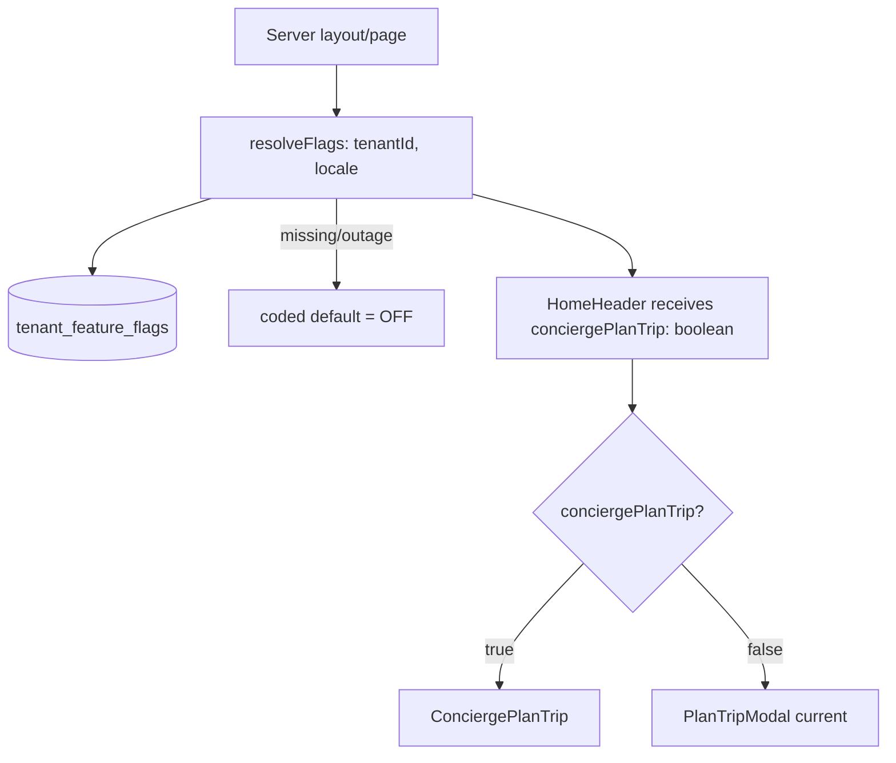

# WhatsApp Concierge Plan-a-Trip — SaaS Feature-Flag Design & Roadmap

> Companion to [whatsapp-booking-feasibility-assessment.md](whatsapp-booking-feasibility-assessment.md).
> Status: **design only** — no implementation yet. This captures the agreed direction:
> build the new WhatsApp concierge Plan-a-Trip as a **feature-flagged, multi-tenant (SaaS)** capability. When the flag is **on** for a tenant, it **replaces** the current Plan-a-Trip modal; when **off** (default), today's behaviour is unchanged.

---

## 1. Product decision

- The concierge flow (structured lead capture → WhatsApp → FareHarbor pay link) ships **behind a per-tenant feature flag**.
- Flag **on** → new `ConciergePlanTrip` replaces the current [PlanTripModal.tsx](../src/components/home/PlanTripModal.tsx) entry point.
- Flag **off** (default) → current WhatsApp deep-link modal stays exactly as-is.
- Scope of the flag is **only** the Plan-a-Trip entry point. It must **not** affect:
  - the FareHarbor direct-book checkout on tour pages,
  - indexable tour/destination pages or structured data (SEO stays intact),
  - the payment path (always a FareHarbor/Stripe pay link — never our own card handling).
- Rollback = flip the flag. No deploy required.

These constraints inherit directly from the feasibility assessment's Final Verdict and Risk Assessment (no reverse-engineering of FareHarbor internals; WhatsApp complements, never replaces, indexable booking surfaces).

---

## 2. Feature-flag architecture (source = Supabase `tenant_feature_flags`)

A thin flag-resolution layer isolates call sites from the source, so the source can evolve without touching UI:

```
src/lib/flags/
  types.ts          // FlagKey union + FlagContext { tenantId, locale }
  resolve.ts        // resolveFlags(ctx) -> Record<FlagKey, boolean> (server-only)
  source.supabase.ts// reads tenant_feature_flags via server Supabase client (RLS-aware)
  defaults.ts       // safe defaults (all new flags default OFF)
```

Principles:
- **Server-side resolution.** Flags are resolved in a Server Component / route handler and passed down as plain boolean props. No flag source or service key reaches the client; avoids UI flash.
- **Fail-safe defaults.** If the tenant row or flag key is missing, resolve to the coded default (**OFF**). A flag-store outage must never break Plan-a-Trip.
- **Single flag for this feature:** `whatsapp_concierge_plan_trip`.
- **Tenant identity.** `tenantId` comes from the existing tenant/site resolution (single tenant today = a constant; SaaS later = per-host/subdomain lookup). Keep the resolver signature stable so multi-tenant is additive.

### 2.1 Proposed migration (additive, RLS-first)

> Sketch for review — not applied. Follows repo Supabase rules: additive, migration-safe, RLS enabled, no PII.

```sql
-- tenants: minimal registry (extend later; may already exist under another name)
create table if not exists public.tenants (
  id          uuid primary key default gen_random_uuid(),
  slug        text not null unique,          -- e.g. 'sevilletoursco'
  created_at  timestamptz not null default now()
);

-- per-tenant feature flags (generic; not specific to this one feature)
create table if not exists public.tenant_feature_flags (
  tenant_id   uuid not null references public.tenants(id) on delete cascade,
  flag_key    text not null,                 -- e.g. 'whatsapp_concierge_plan_trip'
  enabled     boolean not null default false,
  updated_at  timestamptz not null default now(),
  primary key (tenant_id, flag_key)
);

alter table public.tenants enable row level security;
alter table public.tenant_feature_flags enable row level security;

-- Read path: flags are resolved server-side with the service role (bypasses RLS),
-- so no public SELECT policy is granted to anon/auth by default.
-- Admin write policies to be defined with the admin-auth model (out of scope here).
```

Notes:
- No personal data in these tables — safe to evolve freely.
- Reads happen through the **server** Supabase client only; do not expose a public policy just to read flags.
- Flag writes (admin toggling) are deferred to when the admin command center auth model lands.

### 2.2 Resolution flow



---

## 3. Component swap (when the flag is on)

- Resolve `whatsapp_concierge_plan_trip` in the server component that renders the header, pass `conciergePlanTrip` into [HomeHeader.tsx](../src/components/home/HomeHeader.tsx).
- Branch the Plan-a-Trip trigger: `{conciergePlanTrip ? <ConciergePlanTrip/> : <PlanTripModal/>}`.
- Both components remain in the codebase during rollout so toggling is pure configuration and rollback is instant.
- Shared: `buildWhatsAppUrl` (from [urls.ts](../src/lib/wordpress-rest/urls.ts)). The new component adds lead capture + a richer structured message before opening WhatsApp.

---

## 4. Concierge flow (what "on" delivers), phased

1. **Phase 1 — parity + lead capture:** structured form (experience, duration, places, interests, dates, group, language, consent) → `POST /api/trip-inquiry` (Zod validation, rate-limit, Supabase lead with RLS, GDPR consent) → pre-filled WhatsApp deep link. Behaviourally close to today, but leads are now captured and consented.
2. **Phase 2 — concierge tooling:** shared inbox, multilingual reply templates, instant multilingual auto-ack.
3. **Phase 3 — pay link:** generate a FareHarbor booking/pay link (dashboard first; official FareHarbor API later) so the concierge closes the sale without handling cards.
4. **Phase 4 — assist + analytics:** optional AI draft-reply (human-in-the-loop, never binding quotes), funnel analytics, abandonment recovery.

Payment always stays inside FareHarbor/Stripe. We never replay FareHarbor cart/persistence/payment endpoints (see assessment risks 25–29).

---

## 5. Rollout / roadmap

- **R0 (design):** this document. ✅
- **R1:** flag layer (`src/lib/flags/`) + `tenant_feature_flags` migration + gate current modal behind the flag (default **OFF**, zero behaviour change).
- **R2:** `ConciergePlanTrip` Phase 1 (form + `/api/trip-inquiry` + Supabase lead + consent) behind the flag; enable for the pilot tenant only.
- **R3:** concierge tooling + FareHarbor pay-link step (Phases 2–3).
- **R4:** AI assist + analytics + abandonment recovery (Phase 4); measure conversion vs. the legacy modal before defaulting the flag on per tenant.

---

## 6. Open questions

- **Tenant identity in SaaS:** host/subdomain → `tenant_id` mapping. Single-tenant constant for now; confirm the resolution strategy before R1.
- **Admin toggling:** which auth model manages flag writes (admin command center)? Deferred to R2/R3.
- **Client-side flag needs:** any purely client entry points that need the flag without a server round-trip? Prefer server-resolved props to avoid flash and secret exposure.
- **Kill-switch vs. gradual rollout:** boolean per tenant now; add percentage rollout later only if needed (YAGNI until then).
- **Metric of success** to justify defaulting the flag on: conversation→paid conversion and revenue-per-lead vs. the current modal.
